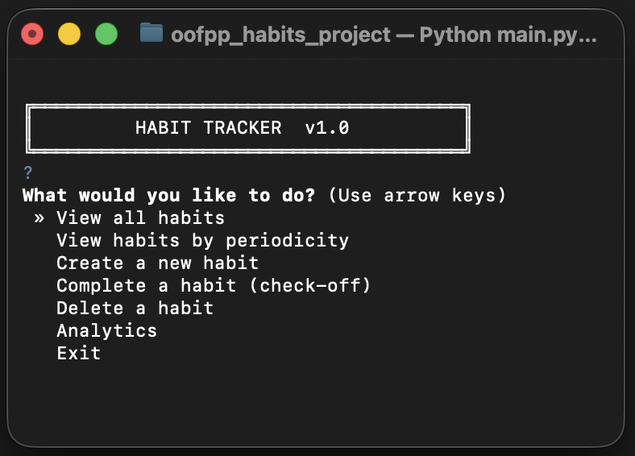
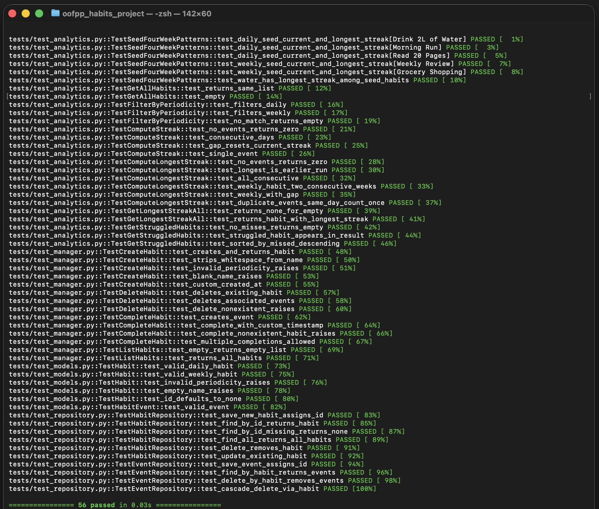
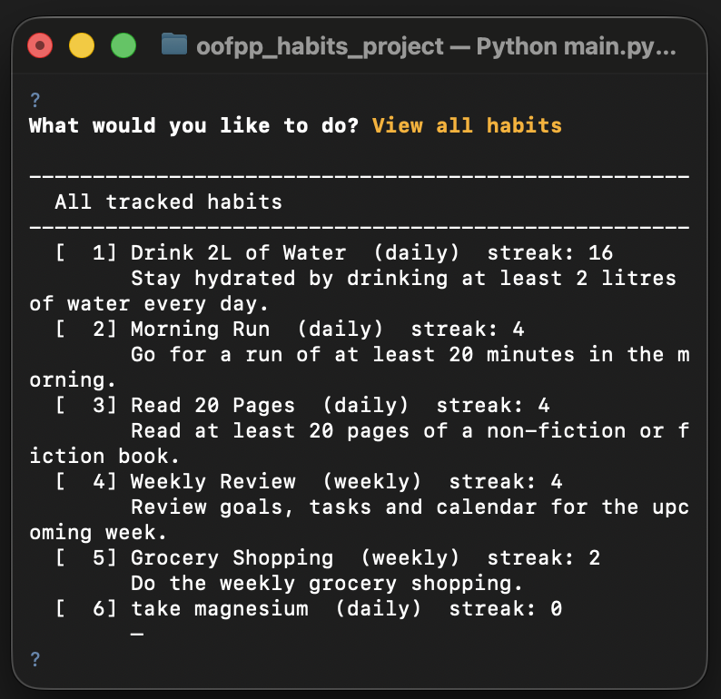
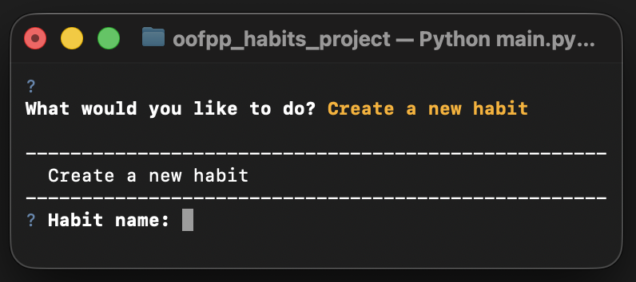
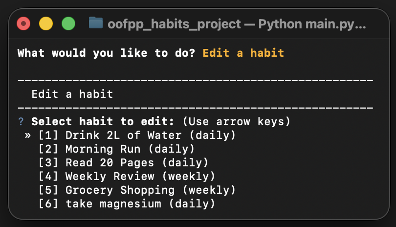
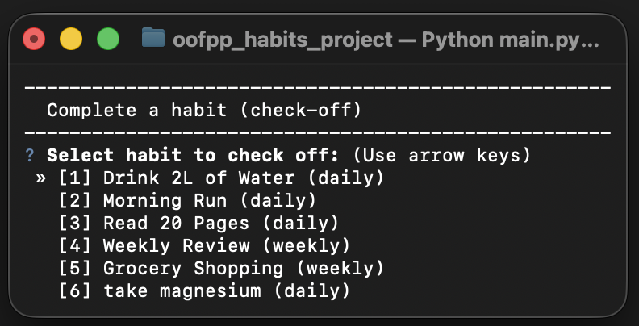
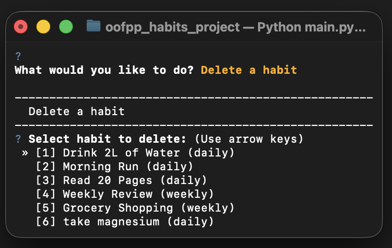
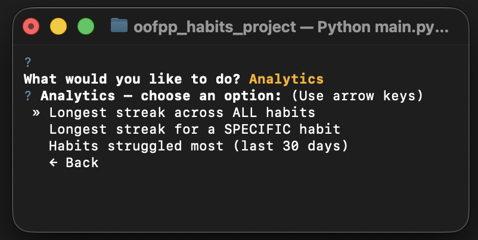

# Habit Tracker App

A command-line Python backend for tracking personal habits.


---

## Features

- Create, manage and delete habits with **daily** or **weekly** periodicity
- Check off habits to record completions
- Persistent storage via **SQLite** (built-in `sqlite3`)
- Analytics module built with **functional programming** (`filter`, `map`, `functools.reduce`):
  - List all tracked habits
  - Filter habits by periodicity
  - Longest streak for a specific habit
  - Longest streak across all habits
  - Most struggled habits in the last 30 days
- 5 predefined habits with **4 weeks** of sample data for exploration
- Full **pytest** unit-test suite (**64 tests**, habits CRUD including edit, analytics, 4-week seed streaks)

---

## Requirements

- Python **≥ 3.10**
- pip

---

## Installation

```bash
git clone https://github.com/marco-hustler/oofpp_habits_project.git
cd oofpp_habits_project
pip install -r requirements.txt
```

---

## Usage

### 1. Load sample data (optional)

Populates the database with 5 predefined habits and 4 weeks of tracking data so you can explore the app straight away:

```bash
python -m data.seed
```

To wipe the database and reload fresh sample data:

```bash
python -m data.seed --reset
```

### 2. Run the app

```bash
python main.py
```

Navigate the interactive menu with the **arrow keys** and **Enter**:



### 3. Run the test suite

```bash
python -m pytest tests/ -v
```

All tests should pass (64 at last run). Coverage includes habit management (create, edit, delete, check-off), analytics (including streak logic on the shared 4-week seed patterns), models, and persistence.



---

## How to View All Habits

Select **"View all habits"** from the main menu.

Each entry shows the habit name, periodicity (`daily` or `weekly`), **current streak**, and description. After loading sample data (`python -m data.seed`), you can see streaks calculated from the predefined 4-week tracking history.



---

## How to Create a Habit

Select **"Create a new habit"** from the main menu.

Enter the habit name (e.g. `Meditate`).

Choose the periodicity: `daily` or `weekly`.

Add an optional description.



The habit is immediately saved to the database and available for check-offs.

---

## How to Edit a Habit

Select **"Edit a habit"** from the main menu, pick the habit, then change the name, periodicity (`daily` or `weekly`), or description.



Check-off history is kept; only the habit details change.

---

## How to Complete (Check-off) a Habit

Select **"Complete a habit (check-off)"** from the menu, then pick the habit from the list.



A timestamped event is recorded and counted towards the current streak.

---

## How to Delete a Habit

Select **"Delete a habit"** from the menu, pick the habit, and confirm.



All associated check-off events are deleted along with it.

---

## Analytics

Open the **Analytics** sub-menu from the main menu:


